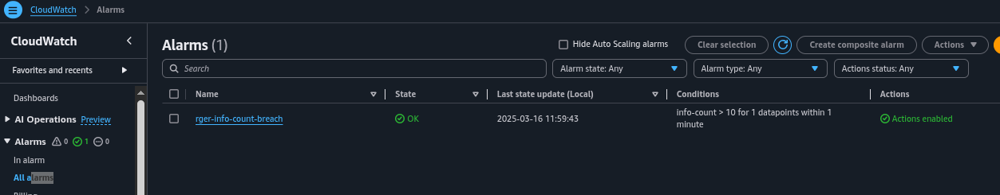

# assignment-2.16-tf-cloudwatch-alarm
Given the Lambda function and metric filters created in the activity, use terraform to create the alarm. 

Create a public github repository that has a terraform code, containing the answer to the above.
Submission is the url to your public github repository.

